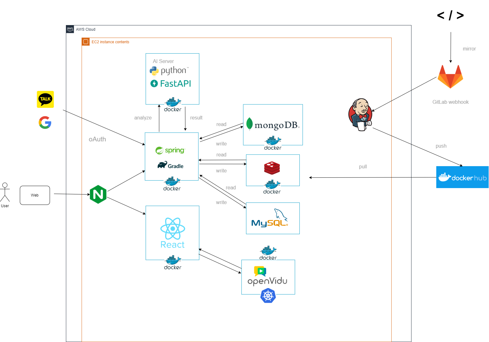

# SSAFY 11기 공통프로젝트 : LeadMe

 

## 🖥️ 프로젝트 소개

**챌린지 가이드 제공**
+ 스켈레톤 가이드라인을 따라하여 평소 만들고 싶었던 나만의 멋진 쇼츠 영상을 완성할 수 있습니다. 이제는 고민하지 말고, 원하는 쇼츠 영상 제작에 직접 도전해볼 수 있습니다.

**나의 챌린지 점수는?**
+ AI 모션 분석 기술로 내 춤 실력을 평가받아보세요! 기존 챌린지 영상과 비교하여 내가 얼마나 정확하게 따라했는지, 실시간으로 점수를 확인할 수 있습니다. 정확하게 따라할수록 높은 점수를 받을 수 있어요. 이제 내 챌린지 실력을 제대로 점검해볼 시간입니다 😎

**친구와 함께하는 챌린지 배틀**
+ 친구와 실시간으로 춤 배틀을 펼쳐보세요! 나의 챌린지 점수와 비교해가며 서로 경쟁하고, 더 즐거운 경험을 만들어가세요. 누가 더 챌린지 고수인지, 지금 바로 확인해보세요 💃

 

## 📹 프로젝트 시연 영상

 

## 🧑‍🤝‍🧑 멤버 구성 및 역할

|FE/BE|이름|역할|
|---|---|-------|
|FE|윤하연|자신이 개발한 내용 기입!|
|FE|임준희|자신이 개발한 내용 기입!|
|BE|남보우|자신이 개발한 내용 기입!|
|BE|박준엽|자신이 개발한 내용 기입!|
|BE|박진우|Jenkins Pipeline 활용 CI/CD 환경 구축, OAuth2.0 회원 서비스, 채팅 서비스, 챌린지 서비스, 피드 서비스, 가이드 서비스|
|BE|양준영|자신이 개발한 내용 기입!|

 

## ⚙️ 개발 환경

FE
---

BE
---
1. 자바 버전 : OpenJDK 17
2. Springboot 버전 : 3.3.1
3. 빌드 & 빌드 도구 : Gradle, Jenkins
4. Git branch 전략 :  

 

## 🛠️ 기술 스택

FE
---

**Library**
 

 

BE
---

**Framework**
 

**DB**
 

**Library**
 

**Protocol & Message Queue**
 

**Server**
 

Comunication
---

 

## 📋 기능 소개

**📌 회원**

> Kakao, Google를 통해 소셜 로그인을 진행한다.  
> JWT 토큰을 이용하여 인증,인가를 진행하며 인가 시간이 초과한 경우 재로그인을 해야 한다. 
> 아이디와,비밀번호를 통하여 인증을 진행하며 일치하지 않을 경우 서비스 사용을 할 수 없다. 

**📌 마이페이지**

> 사용자는 마이페이지에서 자신이 올린 챌린지 영상을 조회할 수 있다.  
> 자신이 팔로워 한 유저 목록, 자신을 팔로잉한 유저 목록을 조회할 수 있다.  
> 채팅 페이지로 이동 및 프로필 편집을 할 수 있다.  

**📌 챌린지 검색**

**📌 챌린지 연습하기**

**📌 챌린지 배틀**

**📌 채팅**

> 사용자는 마이페이지의 메시지목록에서 채팅을 진행할 수 있다. 
> 사용자는 가입된 다른 사용자를 검색하여 채팅방을 개설할 수 있다. 
> 채팅방 생성 및 삭제 시 채팅방 리스트 및 마지막 메세지가 최신화된다. 
> 메시지목록 페이지 진입 시, 사용자가 읽지않은 메시지가 있다면 채팅방에 표시된다. 

**📌 랭킹**

> 사용자가 게시한 챌린지 영상에서 받은 좋아요수의 총 합계를 계산하여 랭킹이 집계된다.  
> 순위가 높은 유저부터 확인할 수 있고, 해당 유저를 클릭시 유저의 피드로 이동할 수 있다.  
> 유저의 프로필 정보, 해당 유저가 받은 좋아요 수, 해당 유저의 팔로워 수를 확인할 수 있다.  

 

## 🏗 아키텍처

 

## 📐 ERD

